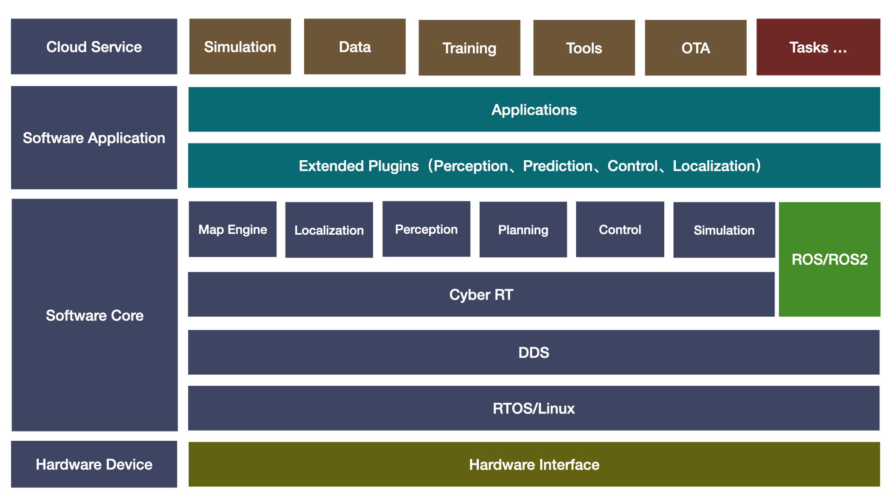

# openbot_ros

## 简介

**Robot Framework** without ros/ros2, use cyberRT node replace ros/ros2 node.



## 工程代码

```bash
mkdir -p openbot/src
cd openbot/src

# openbot
git clone https://github.com/AibotBeginer/openbot.git

# openbot_ros
git clone https://github.com/AibotBeginer/openbot_ros.git

```

## :tanabata_tree:详细文档

**<font color='green'>参考在线文档</font>** 

* [openbot详细文档](https://openbot-doc.readthedocs.io/en/latest/)
* [openbot_ros详细文档](https://openbot-ros-doc.readthedocs.io/en/latest/)

##  编译

```bash
cd openbot
colcon build --symlink-install --packages-up-to openbot_ros --cmake-args -G Ninja
或者
colcon build --symlink-install --packages-up-to openbot_ros
```


## 运行

```bash
# .bashrc 或者.zshrc，添加一下环境变量
export CYBER_PATH=/usr/local/share/
export GLOG_logtostderr=1
export GLOG_log_dir=/openbot/data/log 
export GLOG_alsologtostderr=0
export GLOG_minloglevel=0 

# demo_openbot
ros2 launch openbot_ros demo_openbot.launch.py
```


